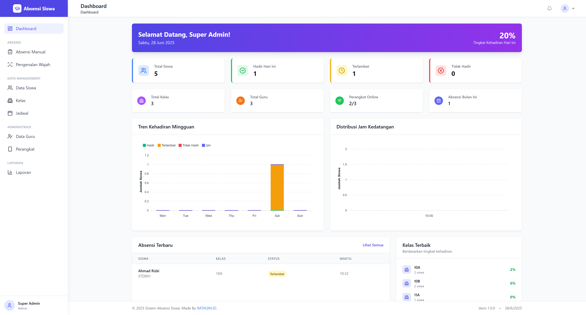
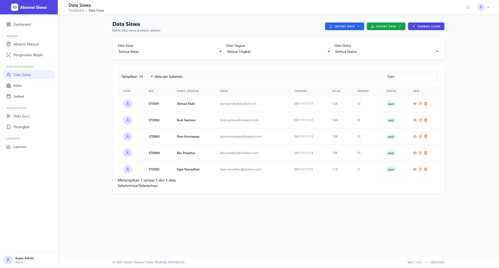
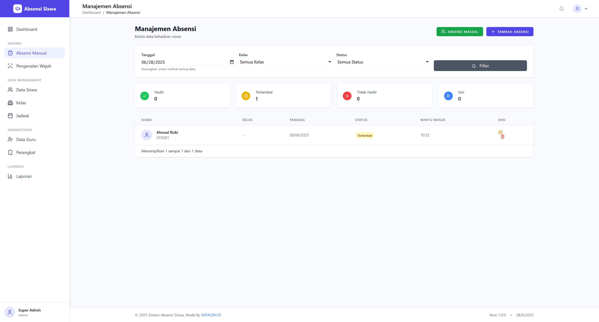
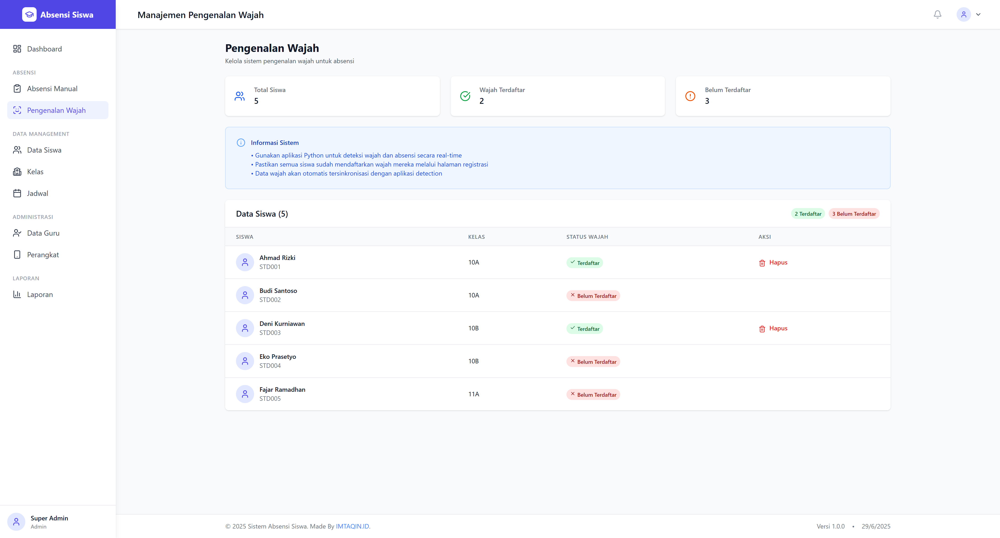
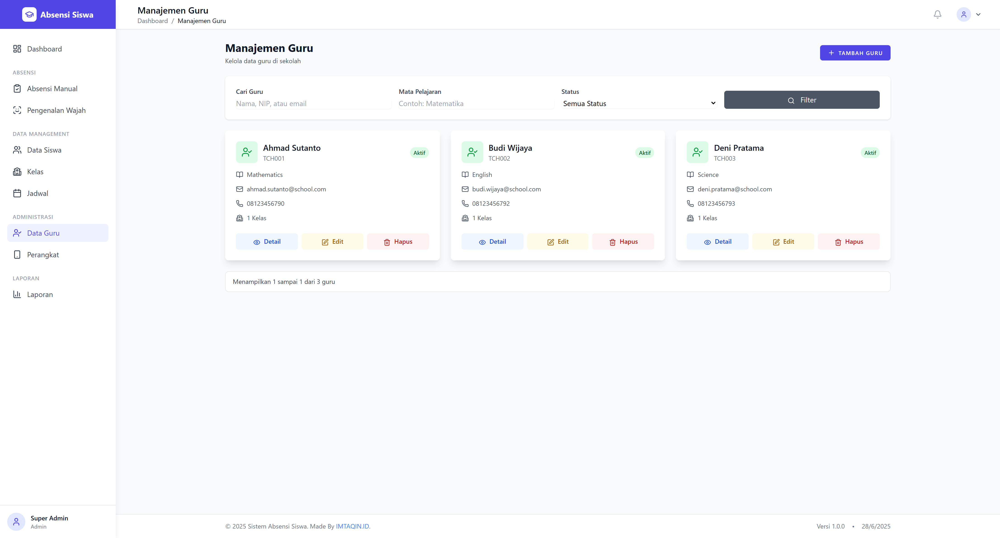
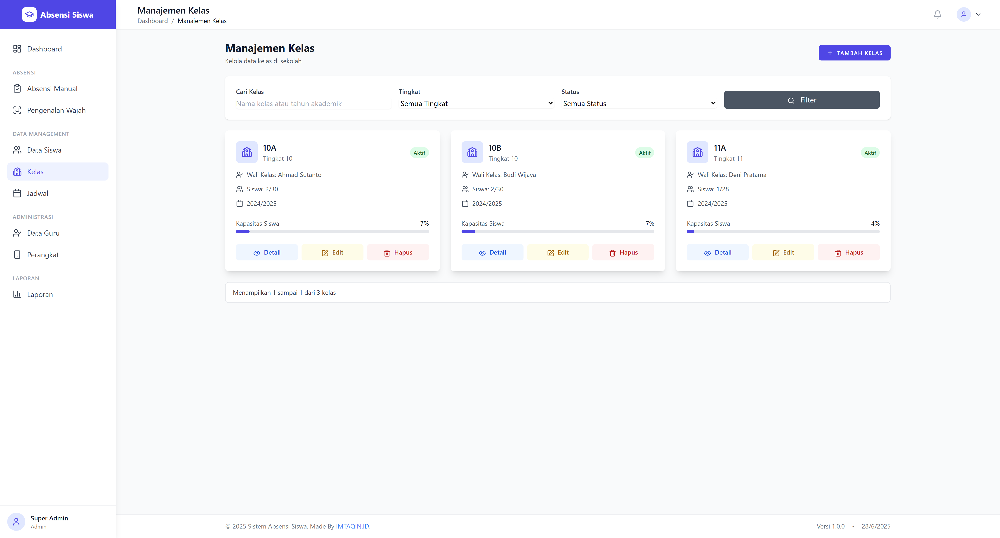
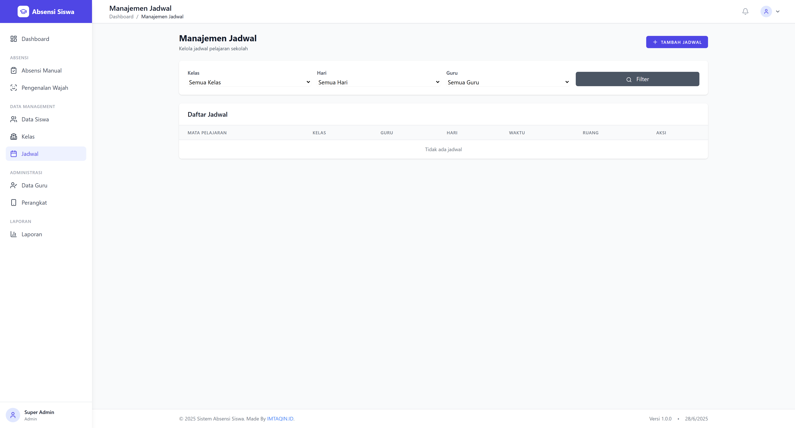
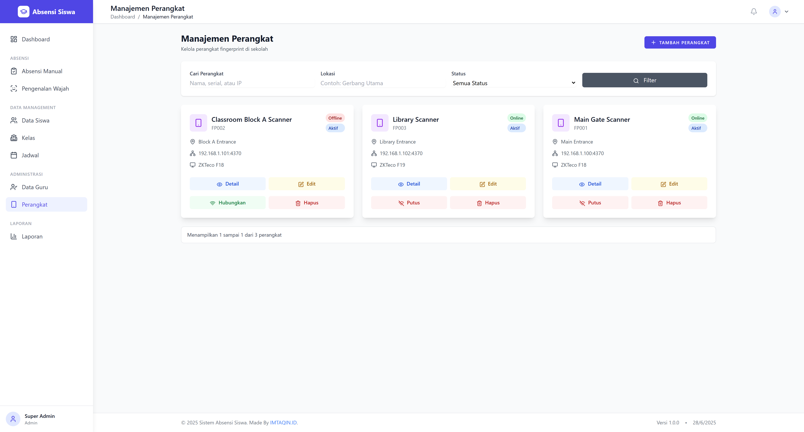
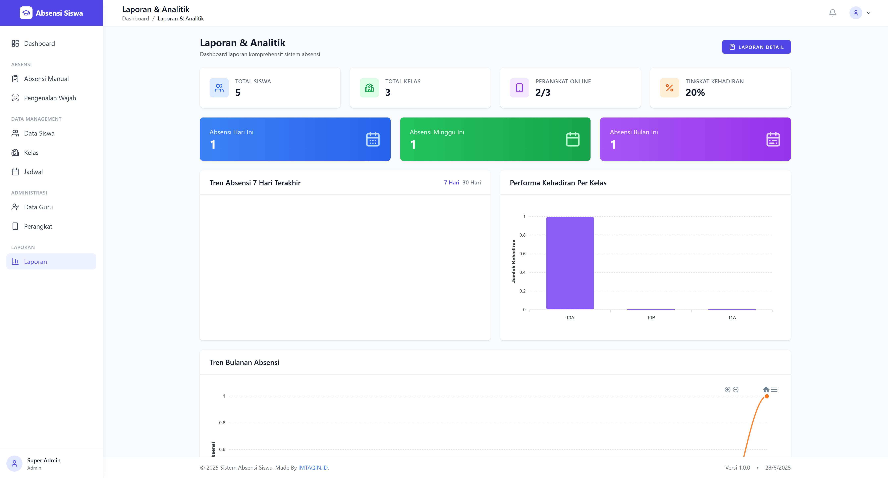

# ABSENSI SISWA DIGITAL

<div align="center">
  <h3>Sistem Absensi Digital Modern untuk Sekolah</h3>
  <p>Solusi lengkap untuk mengelola kehadiran siswa dengan teknologi Fingerprint dan Face Recognition</p>
</div>


## Fitur Utama

### Sistem Absensi Multi-Platform
- **Absensi Manual** - Input kehadiran secara manual oleh admin/guru
- **Fingerprint Recognition** - Integrasi dengan perangkat fingerprint ZKTeco
- **Face Recognition** - Teknologi pengenalan wajah berbasis AI
- **Real-time Monitoring** - Pantau kehadiran siswa secara langsung

### Manajemen Data Komprehensif
- **Data Siswa** - Kelola informasi lengkap siswa dan kelas
- **Data Guru** - Manajemen guru dan mata pelajaran
- **Kelas & Jadwal** - Organisasi kelas dan penjadwalan pelajaran
- **Perangkat** - Monitoring dan kontrol perangkat fingerprint

### Laporan & Analitik
- **Dashboard Interaktif** - Visualisasi data dengan chart dinamis
- **Laporan Detail** - Export ke Excel dengan format profesional
- **Statistik Real-time** - Tingkat kehadiran dan tren bulanan
- **Filter Lanjutan** - Pencarian berdasarkan tanggal, kelas, dan status

## Screenshots

### Dashboard Utama


### Manajemen Data Siswa


### Sistem Absensi Manual


### Face Recognition


### Manajemen Guru


### Manajemen Kelas


### Penjadwalan


### Monitoring Perangkat


### Laporan Kehadiran


### Face Recognition Software


## Persyaratan Sistem

- Node.js 20.6 atau lebih tinggi
- MySQL 8.0+ / MariaDB 10.5+ (bisa eksternal, tidak harus di server yang sama)
- NPM atau Yarn
- Git
- **Opsional (klien absensi wajah):** Python 3.10–3.12 + webcam, atau cukup unduh `.exe` hasil build (lihat bagian Face Recognition Client)
- **Opsional (deploy):** Docker + Docker Compose

## Instalasi Lokal (Development)

### 1. Clone Repository
```bash
git clone https://github.com/fdciabdul/ABSENSI-SISWA-DIGITAL.git
cd ABSENSI-SISWA-DIGITAL
```

### 2. Install Dependencies
```bash
npm install
```

### 3. Konfigurasi Environment
```bash
cp .env.example .env
```

Edit file `.env` dengan konfigurasi database Anda:
```env
DB_HOST=127.0.0.1
DB_PORT=3306
DB_USER=root
DB_PASSWORD=your_password
DB_DATABASE=absensi_siswa
FACE_API_KEY=<string acak, samakan dengan klien Python>
```

### 4. Setup Database
```bash
mysql -u root -p -e "CREATE DATABASE absensi_siswa"
node ace migration:run
npm run seed
```

### 5. Generate Key & Start Server
```bash
node ace generate:key
npm run dev
```

Akses aplikasi di: `http://localhost:3333`

## Deploy dengan Docker (Production)

Aplikasi sudah dilengkapi `Dockerfile` multi-stage dan `docker-compose.yml`. Database bersifat **eksternal** — tidak ada container database yang dijalankan.

### 1. Siapkan Environment

Buat file `.env` di root proyek (atau isi lewat panel deploy Anda). Variabel **wajib**:

| Variabel | Keterangan |
|---|---|
| `APP_KEY` | Generate dengan `node ace generate:key` |
| `FACE_API_KEY` | Token API untuk klien face recognition (harus sama dengan `api_key` di klien) |
| `DB_HOST` | Host database eksternal |
| `DB_PORT` | Port database (default `3306`) |
| `DB_USER` | User database |
| `DB_PASSWORD` | Password database |
| `DB_DATABASE` | Nama database (gunakan database **khusus/kosong** untuk app ini) |

Variabel opsional:

| Variabel | Default | Keterangan |
|---|---|---|
| `APP_PORT` | `3333` | Port host yang di-expose |
| `SEED_ADMIN_PASSWORD` | *(kosong)* | Password akun seed. Kosong = acak, dicetak sekali di log |
| `DEVICE_USER_PASSWORD` | `123456` | Password user yang di-push ke perangkat fingerprint |
| `DB_FRESH` | `false` | Reset database one-shot (lihat di bawah) |
| `APP_NAME` / `TZ` / `LOG_LEVEL` | - | Konfigurasi umum |

> **Penting:** gunakan database yang kosong/khusus untuk aplikasi ini. Jangan berbagi database dengan aplikasi lain — migrasi akan bentrok dengan tabel yang sudah ada.

### 2. Build & Jalankan

```bash
docker compose up -d --build
```

Saat pertama boot, container otomatis:
1. Menunggu database bisa dihubungi (maks 120 detik)
2. Menjalankan **migrasi** (selalu, idempotent)
3. Menjalankan **seeder hanya sekali** (ditandai marker di volume `seed-marker`)

### 3. Reset Database (One-Shot)

Jika database dalam keadaan rusak/setengah termigrasi, set `DB_FRESH=true` lalu redeploy. Pada boot berikutnya **semua tabel di-drop**, migrasi dan seed dijalankan ulang, lalu fitur ini **menonaktifkan dirinya sendiri** — aman dibiarkan `true`, boot selanjutnya berjalan normal.

Untuk mereset lagi di kemudian hari: hapus volume `seed-marker`, lalu redeploy.

### 4. Perintah Berguna

```bash
docker compose logs -f app        # lihat log (password admin seed tercetak di sini)
docker compose down               # stop
docker compose down -v            # stop + hapus semua volume (data upload & marker hilang)
```

Port yang di-expose: **3333** (ubah dengan `APP_PORT`).

## Face Recognition Client

Klien desktop (Windows/Linux) untuk absensi wajah dengan **deteksi liveness** (anti-spoofing: foto diam tidak akan diterima, pengguna harus berkedip).

### Opsi A — Unduh `.exe` (Windows, tanpa install Python)

Repo ini punya GitHub Action **Build Face Recognition Client** yang meng-compile `face_recognition/main.py` menjadi satu file `.exe`:

1. Buka tab **Actions → Build Face Recognition Client → Run workflow**, atau push tag `v*` untuk membuat Release
2. Unduh artifact `absensi-face-client-windows` / asset release
3. Jalankan `absensi-face-client.exe`

### Opsi B — Jalankan dari Source (Python 3.10–3.12)

```bash
cd face_recognition
python -m venv venv
# Windows: venv\Scripts\activate
# Linux:   source venv/bin/activate
pip install -r requirements.txt
python main.py
```

### Setup Klien (Wajib, Sekali Saja)

1. Saat **pertama dijalankan**, password admin acak dicetak **sekali** ke console — catat.
   Jika hilang: hapus `config.json` di sebelah exe/script, jalankan ulang untuk password baru.
2. Buka **Pengaturan** (butuh password admin), lalu isi:
   - **URL Server** — alamat server AdonisJS, mis. `http://192.168.1.10:3333` atau `https://absensi.domain.id`
   - **API Key (x-api-key)** — harus sama persis dengan `FACE_API_KEY` di server
3. Klik **Simpan** — konfigurasi tersimpan permanen di `config.json`.

Tanpa API key yang benar, semua request klien ditolak server (HTTP 401).

### Cara Kerja Absensi Wajah

1. Daftarkan wajah siswa lewat menu registrasi di klien (butuh password admin)
2. Saat wajah dikenali, klien meminta pengguna **berkedip** (verifikasi liveness, maks 4 detik)
3. Kedipan terkonfirmasi → absensi tercatat di server. Foto/rekaman diam akan gagal di tahap ini

## Akun Default (Hasil Seeder)

| Role | Email | Password |
|---|---|---|
| Admin | `admin@school.com` | `SEED_ADMIN_PASSWORD`, atau acak (lihat log) |
| Guru | `john@school.com` | sama seperti di atas |
| Staff | `jane@school.com` | sama seperti di atas |

> Segera ganti password setelah login pertama.

## Troubleshooting

| Masalah | Solusi |
|---|---|
| `Table 'users' already exists` saat migrasi | Database tidak kosong / dipakai app lain. Kosongkan atau set `DB_FRESH=true` sekali |
| `required variable APP_KEY is missing` (compose) | Isi semua variabel wajib di `.env` / env panel |
| Klien: `request ditolak` / HTTP 401 | `api_key` klien ≠ `FACE_API_KEY` server |
| Klien: `Can't open file haarcascade...xml` | Versi exe lama — unduh ulang build terbaru |
| Klien: `No connection could be made` | URL Server masih `localhost`; set ke IP/domain server di Pengaturan |
| Lupa password admin klien | Hapus `config.json` di sebelah exe, jalankan ulang |
| Lupa password admin web | Set `SEED_ADMIN_PASSWORD` lalu reset DB, atau update hash di tabel `users` |

## Dokumentasi

### Struktur Proyek
```
├── app/
│   ├── controllers/          # Controller untuk routing
│   ├── models/              # Model database
│   └── services/            # Business logic
├── database/
│   ├── migrations/          # Skema database
│   └── seeders/            # Data awal
├── resources/
│   └── views/              # Template Edge.js
├── public/                 # Asset statis
└── config/                # Konfigurasi aplikasi
```

### Penggunaan

#### 1. Akses Sistem
- Login menggunakan kredensial admin
- Dashboard menampilkan ringkasan kehadiran real-time

#### 2. Manajemen Siswa
- Tambah data siswa dengan informasi lengkap
- Upload foto untuk sistem face recognition
- Assign siswa ke kelas yang sesuai

#### 3. Konfigurasi Perangkat
- Setup IP address perangkat fingerprint
- Test koneksi dan sinkronisasi data
- Monitor status perangkat secara real-time

#### 4. Laporan dan Analitik
- Generate laporan harian, mingguan, atau bulanan
- Export data ke format Excel
- Analisis tren kehadiran dengan visualisasi chart

## Teknologi yang Digunakan

- **Backend**: AdonisJS 6.x (Node.js Framework)
- **Database**: MySQL 8.0+
- **Frontend**: Edge.js Template Engine
- **Authentication**: AdonisJS Auth
- **Face Recognition**: AI-based facial recognition
- **Hardware Integration**: ZKTeco Fingerprint Devices

## Kontribusi

Kontribusi sangat diterima! Silakan ikuti langkah berikut:

1. Fork repository ini
2. Buat branch untuk fitur baru (`git checkout -b feature/new-feature`)
3. Commit perubahan (`git commit -m 'Add new feature'`)
4. Push ke branch (`git push origin feature/new-feature`)
5. Submit Pull Request

### Guidelines
- Ikuti coding standards yang ada
- Tambahkan test untuk fitur baru
- Update dokumentasi jika diperlukan
- Gunakan commit message yang deskriptif

## Melaporkan Issues

Jika menemukan bug atau memiliki saran, silakan buat [issue baru](https://github.com/fdciabdul/ABSENSI-SISWA-DIGITAL/issues) dengan informasi:
- Deskripsi masalah yang jelas
- Langkah reproduksi bug
- Screenshot (jika ada)
- Informasi environment

## Lisensi

Proyek ini dilisensikan di bawah [MIT License](LICENSE).

## Pengembang

**Taqin**
- GitHub: [@imtaqin](https://github.com/fdciabdul)
- Email: cp@imtaqin.id
- LinkedIn: [linkedin.com/in/fdciabdul](https://linkedin.com/in/fdciabdul)

## Support

Jika proyek ini membantu Anda, berikan star di GitHub dan bagikan ke komunitas!

### Donasi

Dukungan finansial membantu pengembangan berkelanjutan:
- **Bank BRI:** 227401035133504
- **Saweria:** https://saweria.co/fdciabdul

---

<div align="center">

**Made with dedication by Taqin**


</div>
