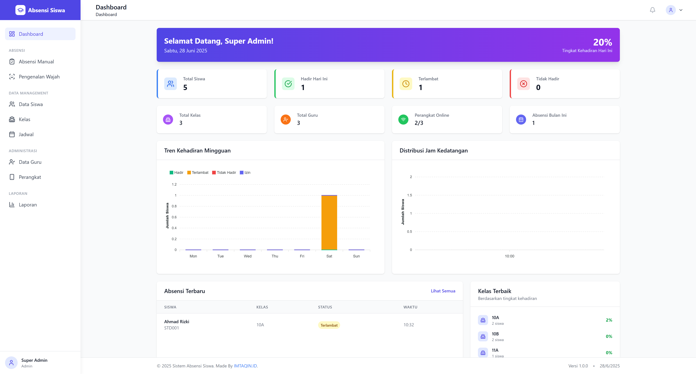
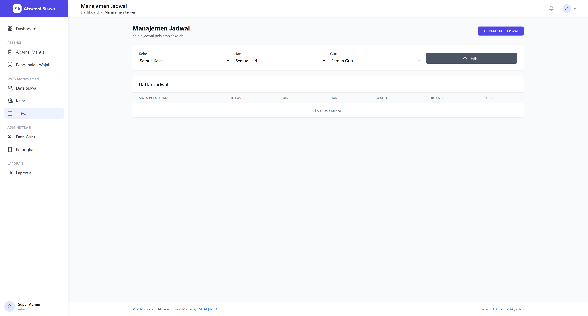

# ABSENSI SISWA DIGITAL

<div align="center">
  <h3>Sistem Absensi Digital Modern untuk Sekolah</h3>
  <p>Solusi lengkap untuk mengelola kehadiran siswa dengan teknologi Fingerprint dan Face Recognition</p>
</div>


## Fitur Utama

### Sistem Absensi Multi-Platform
- **Absensi Manual** - Input kehadiran secara manual oleh admin/guru
- **Fingerprint Recognition** - Integrasi dengan perangkat fingerprint ZKTeco
- **Face Recognition** - Teknologi pengenalan wajah berbasis AI
- **Real-time Monitoring** - Pantau kehadiran siswa secara langsung

### Manajemen Data Komprehensif
- **Data Siswa** - Kelola informasi lengkap siswa dan kelas
- **Data Guru** - Manajemen guru dan mata pelajaran
- **Kelas & Jadwal** - Organisasi kelas dan penjadwalan pelajaran
- **Perangkat** - Monitoring dan kontrol perangkat fingerprint

### Laporan & Analitik
- **Dashboard Interaktif** - Visualisasi data dengan chart dinamis
- **Laporan Detail** - Export ke Excel dengan format profesional
- **Statistik Real-time** - Tingkat kehadiran dan tren bulanan
- **Filter Lanjutan** - Pencarian berdasarkan tanggal, kelas, dan status

## Screenshots

### Dashboard Utama


### Manajemen Data Siswa


### Sistem Absensi Manual


### Face Recognition


### Manajemen Guru


### Manajemen Kelas


### Penjadwalan


### Monitoring Perangkat


### Laporan Kehadiran


### Face Recognition Software


## Persyaratan Sistem

- Node.js 18 atau lebih tinggi
- MySQL 8.0 atau lebih tinggi
- NPM atau Yarn
- Git

## Instalasi

### 1. Clone Repository
```bash
git clone https://github.com/imtaqin/ABSENSI-SISWA-DIGITAL.git
cd ABSENSI-SISWA-DIGITAL
```

### 2. Install Dependencies
```bash
npm install
```

### 3. Konfigurasi Environment
```bash
cp .env.example .env
```

Edit file `.env` dengan konfigurasi database Anda:
```env
DB_HOST=127.0.0.1
DB_PORT=3306
DB_USER=root
DB_PASSWORD=your_password
DB_DATABASE=absensi_siswa
```

### 4. Setup Database
```bash
mysql -u root -p -e "CREATE DATABASE absensi_siswa"
node ace migration:run
npm run seed
```

### 5. Generate Key & Start Server
```bash
node ace generate:key
npm run dev
```

Akses aplikasi di: `http://localhost:3333`

## Dokumentasi

### Struktur Proyek
```
├── app/
│   ├── controllers/          # Controller untuk routing
│   ├── models/              # Model database
│   └── services/            # Business logic
├── database/
│   ├── migrations/          # Skema database
│   └── seeders/            # Data awal
├── resources/
│   └── views/              # Template Edge.js
├── public/                 # Asset statis
└── config/                # Konfigurasi aplikasi
```

### Penggunaan

#### 1. Akses Sistem
- Login menggunakan kredensial admin
- Dashboard menampilkan ringkasan kehadiran real-time

#### 2. Manajemen Siswa
- Tambah data siswa dengan informasi lengkap
- Upload foto untuk sistem face recognition
- Assign siswa ke kelas yang sesuai

#### 3. Konfigurasi Perangkat
- Setup IP address perangkat fingerprint
- Test koneksi dan sinkronisasi data
- Monitor status perangkat secara real-time

#### 4. Laporan dan Analitik
- Generate laporan harian, mingguan, atau bulanan
- Export data ke format Excel
- Analisis tren kehadiran dengan visualisasi chart

## Teknologi yang Digunakan

- **Backend**: AdonisJS 6.x (Node.js Framework)
- **Database**: MySQL 8.0+
- **Frontend**: Edge.js Template Engine
- **Authentication**: AdonisJS Auth
- **Face Recognition**: AI-based facial recognition
- **Hardware Integration**: ZKTeco Fingerprint Devices

## Kontribusi

Kontribusi sangat diterima! Silakan ikuti langkah berikut:

1. Fork repository ini
2. Buat branch untuk fitur baru (`git checkout -b feature/new-feature`)
3. Commit perubahan (`git commit -m 'Add new feature'`)
4. Push ke branch (`git push origin feature/new-feature`)
5. Submit Pull Request

### Guidelines
- Ikuti coding standards yang ada
- Tambahkan test untuk fitur baru
- Update dokumentasi jika diperlukan
- Gunakan commit message yang deskriptif

## Melaporkan Issues

Jika menemukan bug atau memiliki saran, silakan buat [issue baru](https://github.com/imtaqin/ABSENSI-SISWA-DIGITAL/issues) dengan informasi:
- Deskripsi masalah yang jelas
- Langkah reproduksi bug
- Screenshot (jika ada)
- Informasi environment

## Lisensi

Proyek ini dilisensikan di bawah [MIT License](LICENSE).

## Pengembang

**Taqin**
- GitHub: [@imtaqin](https://github.com/fdciabdul)
- Email: cp@imtaqin.id
- LinkedIn: [linkedin.com/in/fdciabdul](https://linkedin.com/in/fdciabdul)

## Support

Jika proyek ini membantu Anda, berikan star di GitHub dan bagikan ke komunitas!

### Donasi

Dukungan finansial membantu pengembangan berkelanjutan:
- **Bank BRI:** 227401035133504
- **Saweria:** https://saweria.co/fdciabdul

---

<div align="center">

**Made with dedication by Taqin**


</div>
